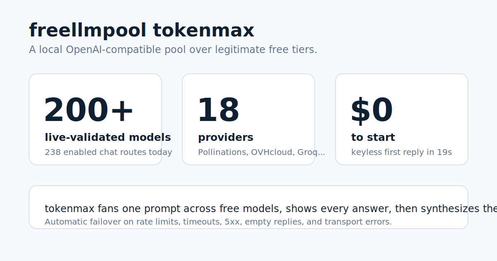

# freellmpool

<!-- mcp-name: io.github.0xzr/freellmpool -->





Pool the free tiers of 18 LLM providers (200+ live-validated, 300+ cataloged
models) behind one OpenAI-compatible endpoint — as a CLI, a Python library, or a
local proxy. Works with no API keys.

[](https://pypi.org/project/freellmpool/)
[](https://github.com/0xzr/freellmpool/actions/workflows/ci.yml)
[](LICENSE)
[](https://0xzr.github.io/freellmpool/)

[FAQ](FAQ.md): where prompts go, ToS posture, failover, bans, and comparisons.

## 30-second quickstart

Fresh install to first free-model reply takes about 19 seconds on a clean
Linux/Python 3.12 environment, with zero API keys:

```bash
python3 -m venv .venv
. .venv/bin/activate
python -m pip install --upgrade pip
python -m pip install freellmpool
freellmpool ask --max-tokens 32 "Reply with one short sentence: freellmpool is ready."
```

CI runs the same path from this checkout with
`FREELLMPOOL_QUICKSTART_PACKAGE=. scripts/quickstart-test.sh`.

Groq, Cerebras, NVIDIA NIM, Google Gemini, OpenRouter, GitHub Models, Cloudflare,
Mistral, Cohere and others each give away a free tier — but each has its own SDK,
rate limits, and daily cap. freellmpool puts them in one pool: it sends each
request to a provider you have access to, fails over to the next when one is rate
limited or down, and tracks per-day usage so you get the most out of every tier.

Several providers (Pollinations, OVHcloud, and Kilo Gateway) need no API key, so
the quickstart above answers immediately.

Add keys for the other providers to unlock more models and higher limits.

## Run a coding agent on free models

freellmpool's proxy speaks both the OpenAI and the Anthropic API, so coding agents
run against pooled free tiers with no code changes — just point them at the proxy:

```bash
freellmpool proxy                       # starts http://localhost:8080
freellmpool code claude                 # prints the one-line setup for Claude Code
# (also: codex, aider, cline, continue, cursor, opencode)
```

Claude Code gateway mode can also be launched directly:

```bash
ANTHROPIC_BASE_URL=http://localhost:8080 \
ANTHROPIC_AUTH_TOKEN=dummy \
ANTHROPIC_MODEL=auto \
ANTHROPIC_SMALL_FAST_MODEL=auto \
CLAUDE_CODE_ENABLE_GATEWAY_MODEL_DISCOVERY=1 \
claude
```

Your existing OpenAI/Anthropic apps work the same way — set `OPENAI_BASE_URL` (or
`ANTHROPIC_BASE_URL`) to the proxy and keep your code unchanged.

**OpenCode** gets a deeper integration: a live in-editor **dashboard** (routing mode,
$ saved, tokens served free, provider race, latency), per-request **quality routing**
via the model picker (`freellmpool/auto|fast|quality|fair`), and `freellmpool_status`
/ `freellmpool_models` tools — see [integrations/opencode-tui](integrations/opencode-tui)
and the [guide](https://0xzr.github.io/freellmpool/run-opencode-on-free-models.html).

**New in 0.11:** capacity tools — `freellmpool capacity status` shows which free
tiers are usable right now, `freellmpool providers health` live-probes them, and
`freellmpool keys add` walks you through configuring more (see
[Capacity & provider health](#capacity--provider-health) and
[docs/CAPACITY.md](docs/CAPACITY.md)).

**New in 0.10:** an async API (`AsyncPool`), an MCP server (`freellmpool mcp`),
latency-aware routing with `freellmpool benchmark`, observability hooks, and a
plugin system for custom providers. See the [changelog](CHANGELOG.md).

## Install

```bash
pip install freellmpool      # or: pipx install freellmpool
```

Only dependency is `httpx`. Python 3.11+.

## Command line

```bash
freellmpool ask "Write a haiku about sqlite"
git diff | freellmpool ask "Write a commit message for this"
freellmpool tokenmax "Hardest question you've got"  # 🌈 blast EVERY model, synthesize the swarm
freellmpool providers        # which providers are configured
freellmpool models           # every provider/model id
freellmpool stats            # lifetime tokens served free + avoided cost
freellmpool badge -o badge.svg   # a shareable SVG badge of that total
```

`freellmpool tokenmax` is the tongue-in-cheek maximum-effort mode: it fans your
prompt out to **every model across every provider** at once, prints each answer, and
synthesizes one best verdict — flashing a rainbow `TOKENMAXXING` animation in your
terminal while it runs. (Also available as the `tokenmax` MCP tool — see
[docs/MCP.md](docs/MCP.md).)

`freellmpool stats` is a running, **persistent** lifetime total (it survives restarts
and upgrades). Embed `freellmpool badge` in a README, or serve it live from the proxy
at `/badge.svg` (set `FREELLMPOOL_PUBLIC_BADGE=1` to make it publicly embeddable).

Pin a provider or model; common OpenAI/Anthropic model names are mapped to a free
equivalent so existing scripts keep working:

```bash
freellmpool ask -m groq/llama-3.3-70b-versatile "hi"
freellmpool ask -p cerebras,groq "hi"
freellmpool ask -m gpt-4o-mini "hi"      # routed to a free model
```

## As a proxy

Run a local server that speaks the OpenAI API, then point any OpenAI-compatible
tool at it:

```bash
freellmpool proxy
export OPENAI_BASE_URL=http://localhost:8080/v1
export OPENAI_API_KEY=unused
```

```python
from openai import OpenAI
client = OpenAI()
print(client.chat.completions.create(
    model="auto",
    messages=[{"role": "user", "content": "hi"}],
).choices[0].message.content)

# audio → text (Whisper), same client:
print(client.audio.transcriptions.create(
    model="auto", file=open("audio.mp3", "rb"),
).text)
```

Or with `curl` (multipart upload):

```bash
curl -s http://localhost:8080/v1/audio/transcriptions \
  -F file=@audio.mp3 -F model=auto
```

The proxy also implements the OpenAI Responses API (for the Codex CLI) and the
Anthropic Messages API (for Claude Code), so coding agents can run on free models
too. `freellmpool code <agent>` prints the exact setup:

```bash
freellmpool code aider       # also: claude, codex, cline, continue, cursor, opencode
```

Endpoints: `/v1/chat/completions` (token streaming, tool calling), `/v1/embeddings`,
`/v1/audio/transcriptions` (Whisper, multipart upload), `/v1/responses`, `/v1/messages`,
`/v1/models`, and a `/dashboard` page showing usage.
Setup snippets for specific tools are in [docs/INTEGRATIONS.md](docs/INTEGRATIONS.md)
and [docs/AGENTS.md](docs/AGENTS.md). The repo also includes an experimental
[metaswarm review adapter](integrations/metaswarm) for using `freellmpool` as an
external-tools reviewer/second opinion.

## As a library

```python
from freellmpool import Pool

pool = Pool.from_default_config()
reply = pool.ask("Summarize the plot of Hamlet in 20 words.")
print(reply.text, "—", reply.provider_id)

vectors = pool.embed(["first document", "second document"]).vectors

with open("audio.mp3", "rb") as f:
    text = pool.transcribe(f.read(), "audio.mp3").text   # Whisper, failover across providers
```

Async is the same API with `await`:

```python
from freellmpool import AsyncPool

async with AsyncPool.from_default_config() as pool:
    reply = await pool.aask("Summarize the plot of Hamlet in 20 words.")
```

Pass `on_event=...` to either pool to receive structured routing/cache events
(`attempt`/`success`/`error`/`cooldown`/`cache_hit`/`cache_miss`/`exhausted`) for logging or tracing. Add
your own endpoint with `register_provider(...)`, or a new request shape with
`register_adapter(name, fn)`.

## Benchmark your providers

`freellmpool benchmark` times one call per configured provider and prints
latency and success, so you can see which of your free tiers are fastest right
now. The router learns the same latency/success signal from real traffic as it
runs; set `FREELLMPOOL_ROUTING=fast` to prefer the lowest-latency provider
instead of the default least-used-first.

```
$ freellmpool benchmark
  provider/model            status   latency  note
  cerebras/llama-3.3-70b    ok        180 ms  6 tok
  groq/llama-3.3-70b        ok        240 ms  6 tok
  ovh/Meta-Llama-3_3-70B    FAIL           -  HTTP 429
```

## Capacity & provider health

Free tiers drift through the day — keys expire, providers go down, daily caps
fill. These commands tell you what's usable right now and what to set up next:

```bash
freellmpool capacity status --target 5   # who's healthy / near quota / missing a key
freellmpool providers health             # send one tiny request to each, time it
freellmpool keys checklist --target 5    # which keys to add to reach N healthy providers
freellmpool keys add groq                # configure a key (and record metadata)
```

`capacity status` is local-first: it reads your catalog, environment, and
per-day quota counters and labels each provider `healthy`, `low_quota`,
`exhausted`, `invalid_key`, or `missing`. It also syncs an advisory external
catalog ([mnfst/awesome-free-llm-apis](https://github.com/mnfst/awesome-free-llm-apis))
to suggest free providers you could add — advisory only; your `providers.toml`
stays the source of truth for routing. `keys add <name>` can even import a
suggested provider from that catalog or create an OpenAI-compatible stub and
autodiscover its models. The proxy `/dashboard` shows the same capacity at a
glance. Full reference: [docs/CAPACITY.md](docs/CAPACITY.md).

## As an MCP server

`freellmpool mcp` runs a Model Context Protocol server over stdio, so Claude
Desktop, Claude Code, or Cursor can hand subtasks to free models. See
[docs/MCP.md](docs/MCP.md). A [`server.json`](server.json) is included for the
[MCP registry](https://registry.modelcontextprotocol.io/).

## In Simon Willison's `llm` CLI

There's a plugin: `llm install llm-freellmpool` → `llm -m freellmpool "..."` with
no API key. Source: [0xzr/llm-freellmpool](https://github.com/0xzr/llm-freellmpool).

## Provider keys

freellmpool reads keys from the environment and uses whatever is set. None are
required. Step-by-step signup links for each (all free, no card) are in
[docs/ACCOUNTS.md](docs/ACCOUNTS.md).

| Provider | Env var | Notes |
|---|---|---|
| Pollinations | — | no key needed |
| OVHcloud | — | no key needed (anonymous tier) |
| LLM7 | `LLM7_API_KEY` | optional |
| Groq | `GROQ_API_KEY` | fast |
| Cerebras | `CEREBRAS_API_KEY` | fast, large daily cap |
| NVIDIA NIM | `NVIDIA_API_KEY` | |
| OpenRouter | `OPENROUTER_API_KEY` | free models |
| Google Gemini | `GEMINI_API_KEY` | |
| GitHub Models | `GITHUB_TOKEN` | any PAT |
| Cloudflare | `CLOUDFLARE_API_TOKEN` + `CLOUDFLARE_ACCOUNT_ID` | |
| Mistral, Cohere, SambaNova, Z.ai, Ollama Cloud, LongCat | see `.env.example` | |

A `config.toml` (see [config.toml.example](config.toml.example)) can hold keys,
model aliases, and settings instead of env vars.

## Local diagnostics and operations

Run `freellmpool doctor` for a no-network local check of package version, config
paths, configured provider count, routing mode, quota/cache locations, external
catalog cache age, and bundled catalog validity.

Response caching is off unless `FREELLMPOOL_CACHE_TTL` (seconds) or
`[settings] cache_ttl` is positive. When enabled, cache rows live in SQLite with
WAL mode and TTL pruning; `FREELLMPOOL_CACHE_MAX_ENTRIES` caps retained rows
(default `10000`, set `0` to disable size pruning).

Quota counters are written immediately by default. Long-running proxy/MCP
processes can reduce file churn with `FREELLMPOOL_QUOTA_FLUSH_EVERY=N`, which
batches up to `N` successful requests before flushing. Shutdown paths and
`quota.snapshot()` flush pending counts, so dashboards and process exits still
see current totals.

## How routing works

For each request, freellmpool builds the list of `(provider, model)` pairs you
have access to, then orders providers least-used-first and picks a least-used
model inside that provider. This keeps providers with large catalogs, like
NVIDIA, from receiving more traffic only because they expose more models. A
provider that returns a 429 is set aside for a cooldown window. Daily counts are
kept in `~/.config/freellmpool/quota.json` and reset at UTC midnight.

Every call records latency and success per model target. A provider whose targets
are currently failing sinks to the back automatically; with
`FREELLMPOOL_ROUTING=fast` the fastest measured provider goes first instead.
`freellmpool benchmark` warms these metrics on demand. To restore the old
per-model balancing behavior, set `FREELLMPOOL_ROUTING=legacy` or
`FREELLMPOOL_ROUTING=model` (or `FREELLMPOOL_ROUTING=model-fast` for the old
per-model fastest-first ordering).

**Quality routing (`FREELLMPOOL_ROUTING=quality`).** Free tiers' strongest models
have the smallest daily caps, so a naive pool gets weaker as the day fills. Quality
routing matches each prompt's *difficulty* to each model's *capability*: hard
prompts (long input, code, reasoning cues) go to the strongest available model, and
easy ones go to lightweight models — which rations scarce strong-model quota so the
pool stays sharp for longer. Capability is grounded in real benchmark data, not
guessed from names; models no benchmark lists fall back to a name heuristic.

The bundled, offline scores come from [LMArena](https://lmarena.ai/) Elo (an
MIT-licensed snapshot) and the [Aider](https://aider.chat/) code-editing
leaderboard (Apache-2.0), normalized to a common percentile scale. For much
broader coverage, run `freellmpool capability sync` with a free
[Artificial Analysis](https://artificialanalysis.ai/) API key
(`FREELLMPOOL_AA_API_KEY`) — its Intelligence Index covers most current and
open-weight models and takes precedence. The fetched AA data is cached locally
under your own key (never bundled, per AA's terms). `freellmpool capability
status` shows current coverage. Scores via LMArena and Aider; intelligence index
via Artificial Analysis when keyed.

**Context windows.** Free models often have small context windows. freellmpool
never truncates your input; instead, when a model rejects a request as too long,
it learns that model's limit and stops routing oversized requests there, escalating
only to larger-window models. If nothing fits it raises a clear
`ContextWindowExceeded` (with the estimated input size) instead of a generic
failure — over the proxy that's a `413`. You can declare a model's window with
`context = N` in `providers.toml` to skip it proactively.

Architecture notes: [docs/ARCHITECTURE.md](docs/ARCHITECTURE.md).

## Limitations

- Free-tier models are smaller than frontier models. They're good for drafting,
  summarizing, classification, triage, and everyday coding — not a replacement
  for GPT-class reasoning on hard problems.
- Quality and capacity vary through the day as high-cap tiers exhaust; limits
  reset at UTC midnight.
- Free tiers change without notice. When a model id or limit goes stale, a
  one-line PR to `providers.toml` fixes it for everyone.
- The proxy is meant for local/single-user use. It binds to `127.0.0.1` by
  default; if you expose it, set a key (`--api-key`).
- The Claude Code / Anthropic path is experimental (text and tool use; no vision).
- These are free tiers shared by everyone — don't abuse them.

## How it compares

| Tool | Keyless start | # providers | Failover | MCP server | CLI | Transcription | Local/self-hosted | License |
|---|---|---:|---|---|---|---|---|---|
| **freellmpool** | Yes: Pollinations, OVHcloud, Kilo Gateway; LLM7 is key-optional | 18 built-in chat providers | Yes: tries the next provider on rate limits, timeouts, 5xx, empty replies, and transport errors | Yes: `freellmpool mcp` | Yes: `freellmpool ask`, `tokenmax`, `providers`, `proxy`, and more | Yes: OpenAI-compatible `/v1/audio/transcriptions` with provider failover | Yes: local Python package and local proxy | MIT |
| OpenRouter free models | No: OpenRouter account/API key required | One hosted OpenRouter account routing across many upstreams; the free-model router currently lists free variants | Yes: OpenRouter handles provider routing/fallbacks | Not a native MCP server; OpenRouter docs show MCP-client/tool patterns | No first-party local CLI in the docs checked | Yes: OpenRouter now documents audio transcription APIs | No: hosted service | Proprietary service |
| LiteLLM | No: bring provider keys or hosted LiteLLM credentials | 100+ LLM providers | Yes: router/fallbacks, including transcription fallbacks | Yes: LiteLLM Proxy includes an MCP Gateway | Yes: SDK/proxy command surface, not a one-shot free-model CLI | Yes: `/audio/transcriptions` support | Yes: self-host the proxy or use hosted LiteLLM | MIT for core repo; commercial license for enterprise-only pieces |
| FreeLLMAPI | No: add your own free-tier provider keys; keyless providers can be configured after setup | 16 free-tier providers plus custom OpenAI-compatible endpoints | Yes: fallback chain on 429, 5xx, and timeouts | No native MCP server in the README checked | Dashboard/server, desktop app, and Docker; no first-class one-shot CLI in the README checked | No: `/v1/audio/*` is listed as not yet supported | Yes: self-hosted Node/Docker proxy | MIT |

FreeLLMAPI predates this project, and the overlap is independent convergence:
both projects noticed that legitimate free tiers are useful when treated
carefully. freellmpool's niche is the **keyless, pip-installable client** for
squeezing hosted free tiers from a CLI, library, local proxy, and MCP server;
OpenRouter is the polished hosted route; LiteLLM is the mature bring-your-own-key
gateway.

Table sources: freellmpool's catalog and proxy code in this repo; OpenRouter's
quickstart, free-model, routing, and audio docs; LiteLLM's README, MCP docs, and
audio transcription docs; FreeLLMAPI's README.

## FAQ

**Is there a free, OpenAI-compatible LLM API gateway?** Yes — freellmpool is a free,
MIT-licensed gateway that exposes one OpenAI-compatible endpoint backed by the free
tiers of 18 providers. `pip install freellmpool` and point any OpenAI client at the
local proxy.

**How do I use multiple free LLM APIs at once?** freellmpool pools them: each request
goes to a provider you have access to, fails over to the next when one is rate-limited
or down, and tracks per-day usage so load spreads across tiers.

**Can I run Claude Code or Codex on free models?** Yes — the proxy speaks both the
OpenAI and Anthropic APIs. Set `OPENAI_BASE_URL` or `ANTHROPIC_BASE_URL` to the proxy
and run Codex, Claude Code, aider, Cline, Continue, or Cursor unchanged. For Claude
Code, set `CLAUDE_CODE_ENABLE_GATEWAY_MODEL_DISCOVERY=1` so `/v1/models` is discovered
through the Anthropic bridge. See `freellmpool code <agent>`. (Claude Code path is
experimental: text + tools, no vision.)

**Do I need an API key?** No — Pollinations, OVHcloud, and Kilo Gateway work with no key, so a fresh
install answers immediately. Add free keys for the other providers for more models and
higher limits.

**Is it free and open source?** Yes, MIT-licensed. More at the
[project page](https://0xzr.github.io/freellmpool/).

## Featured in

- Community videos (Spanish, by lytohlg AI): ["Accede a 18 modelos de IA GRATIS con 1 solo comando"](https://www.youtube.com/watch?v=1UfIlWoedho) and ["Prueba 18 IAs GRATIS sin API key en 30 segundos"](https://www.youtube.com/watch?v=oaM_E92WVGQ).
- Directory: [FreeLLM Pool on MCP Market](https://mcpmarket.com/server/freellm-pool).

## Contributing

New providers and fixes to stale limits are the most useful contributions, and
both are usually a small change to `providers.toml`. See
[CONTRIBUTING.md](CONTRIBUTING.md). Maintainer-ready newcomer tasks are drafted in
[docs/GOOD_FIRST_ISSUES.md](docs/GOOD_FIRST_ISSUES.md). Tests run with no network access:

```bash
python -m pip install -e ".[dev]" && ruff check . && pytest
```

## License

MIT
